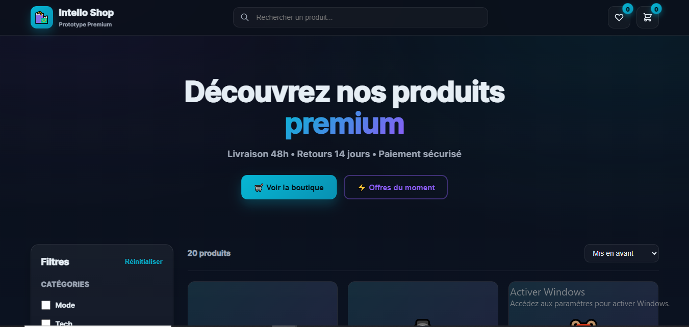

# ✅ README.md corrigé et optimisé

**Remplace tout le contenu de `README.md` par ceci :**

```markdown
# 🛍️ E-Commerce Platform Premium

Plateforme e-commerce moderne avec panier, wishlist et filtres avancés — Prototype premium par [Intello](https://intello.sn).



---

## ✨ Fonctionnalités

- **🛒 Panier fonctionnel** : Ajouter/retirer produits, gestion quantités, calcul total
- **❤️ Wishlist** : Système de favoris avec toggle interactif
- **🔍 Recherche live** : Filtrage instantané par nom de produit
- **🎯 Filtres avancés** : Multi-catégories, budget, stock disponible
- **📊 Tri intelligent** : Prix croissant/décroissant, nouveautés, mis en avant
- **🎨 Design glassmorphism** : Gradients fluides, animations subtiles
- **📱 Responsive** : Optimisé mobile/tablette/desktop
- **🔔 Notifications toast** : Retours visuels sur chaque action

---

## 🛠️ Stack technique

- **HTML5 + CSS3** : Variables, gradients, animations
- **JavaScript ES6+** : Vanilla (state management)
- **20 produits** : Données fictives avec descriptions
- **Accessibilité** : Modals (Escape to close)

---

## 🚀 Installation

### Option 1 : Ouverture directe
Double-cliquez sur `index.html`

### Option 2 : Serveur local

```bash
# Cloner le repo
git clone https://github.com/intello-agence/ecommerce-platform-prototype.git
cd ecommerce-platform-prototype

# Lancer serveur (choisir une méthode)
python -m http.server 8000
# OU
npx http-server -p 8000
# OU utiliser l'extension "Live Server" de VS Code
```

Puis ouvrir **http://localhost:8000**

---

## 📸 Screenshots

### Interface principale


### Grille produits avec filtres


---

## 📦 Structure

```
ecommerce-platform-prototype/
├── index.html          # Structure HTML
├── styles.css          # Styles (glassmorphism, animations)
├── app.js              # Logique panier + filtres
├── screenshots/        # Captures d'écran
│   ├── interface-ecommerce.png
│   └── produits.png
└── README.md           # Documentation
```

---

## 🎮 Utilisation

### Fonctionnalités principales

| Fonctionnalité | Description |
|----------------|-------------|
| **Filtres catégories** | Mode / Tech / Maison / Sport (multi-sélection) |
| **Budget** | Tranches de prix 0-20k, 20-50k, 50-100k, 100k+ |
| **Stock** | Afficher uniquement produits disponibles |
| **Tri** | Mis en avant, prix croissant/décroissant, nouveautés |
| **Recherche** | Filtrage instantané par nom |

### Actions utilisateur

- **❤️ Wishlist** : Cliquer sur l'icône cœur
- **🛒 Panier** : Ajouter produits, ajuster quantités (+/−)
- **👁️ Détails** : Modal avec description complète
- **💳 Checkout** : Validation panier (simulé)

---

## 🎨 Personnalisation

Les produits sont définis dans `app.js` (tableau `PRODUCTS`).  
Pour connecter une API réelle :

```javascript
// Remplacer PRODUCTS par :
async function fetchProducts() {
  const res = await fetch('/api/products');
  return res.json();
}
```

---

## 📄 Licence

MIT License — Libre d'utilisation commerciale et personnelle.

---

## 👤 Auteur

**Intello** — Agence digitale Dakar 🇸🇳

- 🌐 Site : [intello.sn](https://intello.sn)
- 📧 Email : contact@intello.sn
- 📱 WhatsApp : +221 77 553 28 04
- 💼 GitHub : [@intello-agence](https://github.com/intello-agence)

---

## ⭐ Support

Si ce prototype vous a été utile :

- ⭐ **Star** le repo
- 🐦 Partager sur [LinkedIn](https://linkedin.com/company/intello-agence) / Twitter
- 📧 Nous contacter pour un projet sur mesure

---

**Fait avec passion à Dakar par [Intello](https://intello.sn)**
```

---

