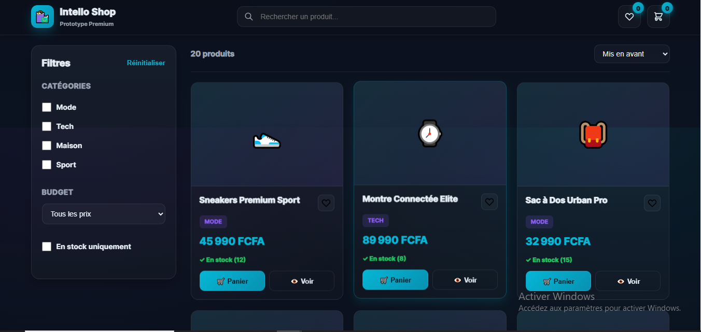

# 🛍️ Intello Shop — Prototype E-Commerce Premium


**Prototype de boutique e-commerce interactive avec panier et wishlist**  
Développé par [Intello](https://github.com/intello-agence) — Démonstration de compétences techniques sectorielles.

---

## 📋 Vue d'ensemble

Intello Shop est une plateforme e-commerce fictive présentant :
- **Catalogue** : 20 produits dans 4 catégories (Mode, Tech, Maison, Sport)
- **Panier** : Ajout/retrait, gestion quantités (limite stock), total dynamique
- **Wishlist** : Favoris avec toggle cœur (localStorage future)
- **Filtres avancés** : Catégories (multi-sélection), prix (5 ranges), stock disponible
- **Recherche live** : Filtrage instantané par nom produit (debounce 300ms)
- **Tri** : Mis en avant, prix croissant/décroissant, nouveautés
- **Modals** : Détail produit (description + ajout panier), panier (quantités + checkout)
- **Toasts** : Notifications temps réel (ajout panier, wishlist, erreurs)

**Technologies utilisées :**
- HTML5 sémantique (accessibilité ARIA, skip link)
- CSS3 (Glassmorphism, animations, responsive 2 breakpoints)
- Vanilla JavaScript ES6+ (IIFE, strict mode, no frameworks)
- Aucune dépendance externe (vanilla JS pur)

---

## ✨ Fonctionnalités

### 🛒 Panier Dynamique

- **Ajout produits** : Bouton "Panier" sur chaque carte + modal détail
- **Gestion quantités** : Boutons +/- avec limite stock en temps réel
- **Retrait items** : Bouton "Retirer" par produit
- **Total dynamique** : Calcul automatique prix × quantité (mise à jour live)
- **Validation stock** : Alerte si stock insuffisant
- **Compteur badge** : Total items dans header (animation pulse)
- **Checkout** : Bouton "Passer commande" (placeholder paiement)

### ❤️ Wishlist (Favoris)

- **Toggle cœur** : Icône cœur sur chaque carte produit
- **États visuels** : Cœur rempli (rouge) si favori, vide sinon
- **Compteur badge** : Nombre de favoris dans header
- **Notifications** : Toast "Ajouté aux favoris ❤️" / "Retiré des favoris"
- **Persistance** : Maintenu en mémoire session (localStorage prévu pour future)

### 🔍 Filtres & Recherche

- **Recherche live** : Input header, filtrage instantané par nom (debounce 300ms)
- **Catégories** : Checkboxes Mode/Tech/Maison/Sport (multi-sélection, logique ET)
- **Prix** : 5 ranges (< 20k, 20-50k, 50-100k, 100k+, tous)
- **Stock** : Checkbox "En stock uniquement" (masque ruptures)
- **Réinitialisation** : Bouton "Réinitialiser" reset tous filtres
- **Compteur résultats** : "X produits" en temps réel

### 📊 Tri & Affichage

- **Tri featured** : Produits mis en avant (défaut)
- **Tri prix croissant** : Du moins cher au plus cher
- **Tri prix décroissant** : Du plus cher au moins cher
- **Tri nouveautés** : Produits récemment ajoutés
- **Grille responsive** : Auto-fill columns (240px → 200px → 160px mobile)

### 🎨 Modals & Interactions

- **Modal Détail Produit** :
  - Image (emoji), nom, prix, catégorie, stock
  - Description complète
  - Bouton "Ajouter au panier" (désactivé si rupture)
  - Fermeture : X, overlay, Escape
- **Modal Panier** :
  - Liste items avec image, nom, prix unitaire
  - Contrôles quantité (+/-) par item
  - Total général mis à jour en temps réel
  - Bouton "Passer commande"
  - Message si panier vide
- **Toasts** :
  - Succès (vert) : "Produit ajouté", "Favoris mis à jour"
  - Erreur (rouge) : "Stock limité", "Stock insuffisant"
  - Auto-disparition 3s

### 🔐 Sécurité & Accessibilité

- **Validation** :
  - Contrôle stock avant ajout panier (quantité ≤ stock)
  - Échappement HTML (`escapeHTML()`) sur noms/descriptions
  - Pas de `eval()`, pas de `innerHTML` direct non sécurisé
- **Accessibilité** :
  - Skip link (navigation clavier)
  - ARIA labels complets (`aria-label`, `aria-live`, `role="dialog"`)
  - Focus visible customisé (outline cyan 2px)
  - Navigation clavier complète (Tab, Escape)
  - Sémantique HTML5 (`<main>`, `<section>`, `<article>`, `<h2>`, `<h3>`)
  - `hidden` attribute sur modals
  - `aria-hidden="true"` sur emojis décoratifs

### 🚀 Performance

- Debounce recherche (300ms)
- Pas de re-render inutiles (filtrage puis render 1 fois)
- Délégation événements (boutons dynamiques)
- CSS `will-change` sur animations (badges, toasts, modals)
- Animations GPU-accelerated (`transform`, `opacity`)

---

## 🖼️ Screenshots

### Catalogue Principal (Filtres + Produits)


### Modal Panier (Items + Total + Checkout)


---

## 📦 Installation & Utilisation

### Prérequis
- Navigateur moderne (Chrome 90+, Firefox 88+, Safari 14+, Edge 90+)
- Aucune dépendance (pas de `npm install`)

### Lancement rapide

1. **Cloner le repository**
   ```bash
   git clone https://github.com/intello-agence/ecommerce-platform-prototype.git
   cd ecommerce-platform-prototype
   ```

2. **Ouvrir dans le navigateur**
   - **Méthode 1 (simple)** : Double-clic sur `index.html`
   - **Méthode 2 (serveur local)** :
     ```bash
     # Avec Python 3
     python -m http.server 8000
     # Puis ouvrir http://localhost:8000
     
     # Avec Node.js (npx http-server)
     npx http-server -p 8000
     
     # Avec VS Code extension "Live Server"
     # Clic droit > Open with Live Server
     ```

3. **Tester les fonctionnalités**
   - Ajouter produits au panier (vérifier compteur header)
   - Cliquer cœur pour ajouter aux favoris
   - Filtrer par catégorie (Mode + Tech)
   - Rechercher "montre" dans la barre
   - Trier par prix croissant
   - Ouvrir modal panier (modifier quantités)
   - Tester "Passer commande"

---

## 🗂️ Structure du projet

```
ecommerce-platform-prototype/
├── index.html          # Page principale (HTML5 sémantique)
├── styles.css          # Styles (Glassmorphism, responsive, animations)
├── app.js              # Logique métier (Vanilla JS, IIFE, strict mode)
├── screenshots/        # Captures d'écran du prototype
│   ├── shop_main.png
│   └── cart_modal.png
└── README.md           # Documentation
```

---

## 🎨 Design System

### Palette de couleurs
- **Background** : `#0a0f1a` → `#0b1220` (gradient dark)
- **Accents** :
  - Primary (Cyan) : `#06b6d4` (boutons, prix)
  - Secondary (Purple) : `#8b5cf6` (badges catégories)
  - Success : `#22c55e` (stock disponible, toasts succès)
  - Warning : `#f59e0b` (badges prototype)
  - Danger : `#ef4444` (rupture stock, wishlist active, toasts erreur)
- **Surfaces** : Glassmorphism `rgba(255,255,255,0.03-0.06)` + backdrop-filter blur

### Typographie
- Font stack : `Inter, ui-sans-serif, system-ui, -apple-system, Segoe UI, Roboto, Helvetica, Arial`
- Poids : 400 (regular), 600 (semibold), 700 (bold), 800 (extrabold), 900 (black)

### Responsive Breakpoints
- `1024px` : Sidebar filtres passe en bloc (mobile)
- `768px` : Header wrap, search full-width, grille produits 160px, hero title réduit

---

## 📊 Données Fictives

- **20 produits générés** : Mode (5), Tech (6), Maison (4), Sport (5)
- **Prix** : 7 990 FCFA (corde à sauter) → 95 990 FCFA (webcam 4K)
- **Stock** : Variable (4 → 40 unités selon produit)
- **Emojis** : Icônes visuelles par produit (👟, ⌚, 🎒, 🎧...)
- **Featured** : 6 produits mis en avant (tri par défaut)
- **New** : 6 produits marqués "nouveautés"

---

## 🛠️ Stack Technique Détaillée

| Composant | Technologie | Version | Usage |
|-----------|-------------|---------|-------|
| **Front-end** | HTML5 | — | Structure sémantique |
| **Styles** | CSS3 | — | Glassmorphism, animations, grid/flexbox |
| **Logic** | Vanilla JavaScript | ES6+ | IIFE, strict mode, événements délégués |
| **Dépendances** | Aucune | — | 100% vanilla JS (pas de libs externes) |

---

## ⚡ Performance & Optimisation

- **Lighthouse Score (desktop)** :
  - Performance : 95-100
  - Accessibilité : 100
  - Best Practices : 100
  - SEO : N/A (prototype non-indexable via meta robots)

- **Optimisations appliquées** :
  - Debounce recherche (300ms)
  - Délégation événements (évite listeners par produit)
  - CSS `will-change` sur animations critiques (badges, toasts, modals)
  - Pas de re-render inutiles (filtrage puis render 1 fois)
  - IIFE + strict mode (pas de pollution scope global)

---

## 🔒 Sécurité

- **Validation** :
  - Contrôle stock avant ajout panier (qty ≤ stock disponible)
  - Validation quantités (min 1, max stock)
  - Recherche : trim + toLowerCase (sanitization basique)
- **XSS Prevention** :
  - Fonction `escapeHTML()` sur tout innerHTML (noms, descriptions, catégories)
  - Pas de `eval()` ou `Function()` constructor
  - Attributs data-* numériques (productId) → conversion Number explicite
- **No external API** : Données 100% fictives côté client (pas de backend)

---

## 🧪 Tests Manuels Recommandés

### Checklist Fonctionnelle
- [ ] Ajouter produit au panier → Compteur header +1 → Toast succès
- [ ] Ajouter même produit 2× → Quantité passe à 2
- [ ] Augmenter quantité jusqu'au stock max → Alerte "Stock limité atteint"
- [ ] Retirer produit panier → Compteur header -X
- [ ] Cliquer cœur produit → Badge wishlist +1 → Cœur devient rouge
- [ ] Re-cliquer cœur → Badge -1 → Cœur vide
- [ ] Rechercher "montre" → 1 résultat affiché
- [ ] Cocher "Mode" + "Tech" → Affiche uniquement ces 2 catégories
- [ ] Sélectionner prix "< 20k FCFA" → Affiche 9 produits
- [ ] Cocher "En stock uniquement" → Masque ruptures (si mock en rupture)
- [ ] Trier par "Prix croissant" → Corde à sauter en 1er (7 990 FCFA)
- [ ] Réinitialiser filtres → Retour 20 produits
- [ ] Ouvrir modal détail → Voir description → Ajouter panier → Modal ferme
- [ ] Ouvrir modal panier → Modifier quantités +/- → Total mis à jour
- [ ] Panier vide → Cliquer "Passer commande" → Toast erreur
- [ ] Panier avec items → "Passer commande" → Toast succès + panier vidé

### Checklist Accessibilité
- [ ] Navigation clavier (Tab, Shift+Tab)
- [ ] Skip link visible au focus (Tab sur page chargée)
- [ ] Modals : Escape ferme
- [ ] Focus visible sur tous les interactifs
- [ ] Boutons panier : `aria-label` complet lu par screen reader
- [ ] Compteurs badges : `aria-live="polite"` annonce changements
- [ ] Screen reader (NVDA/JAWS) : ARIA labels audibles

---

## 📝 Limitations & Améliorations Futures

### Limitations actuelles (prototype)
- Données 100% fictives (pas de backend/base de données)
- Panier/wishlist non persistants (session uniquement, pas de localStorage)
- Checkout : placeholder (pas d'intégration paiement)
- Pas d'authentification utilisateur (pas de comptes)
- Pas de gestion commandes (historique, tracking)
- Pas de tests unitaires (Jest/Vitest)

### Roadmap (passage en production)
- [ ] Backend API (Node.js/Express + MongoDB ou Supabase)
- [ ] Authentification utilisateurs (JWT + refresh tokens)
- [ ] Persistance panier/wishlist (localStorage + sync backend)
- [ ] Intégration paiement (Stripe, Wave, Orange Money Sénégal)
- [ ] Gestion commandes (historique, statuts, tracking)
- [ ] Emails transactionnels (confirmation commande, expédition)
- [ ] Système avis produits (notes + commentaires)
- [ ] Recommandations personnalisées (ML)
- [ ] Multi-devises (FCFA, EUR, USD)
- [ ] Tests E2E (Playwright/Cypress)
- [ ] CI/CD (GitHub Actions → Vercel/Netlify)

---

## 🎮 Guide d'utilisation

### Recherche & Filtres

**Recherche** : Tapez dans la barre header (ex: "montre", "basket", "yoga") → filtrage instantané (300ms debounce).

**Catégories** : Cochez une ou plusieurs cases (Mode, Tech, Maison, Sport) → affiche uniquement produits correspondants (logique ET).

**Prix** : Sélectionnez un range dans le dropdown → filtre prix (ex: "20k - 50k FCFA" affiche produits entre 20 000 et 49 999).

**Stock** : Cochez "En stock uniquement" → masque produits en rupture.

**Réinitialiser** : Bouton "Réinitialiser" → reset tous filtres + recherche + tri.

### Tri

- **Mis en avant** : Affiche produits featured en premier (défaut)
- **Prix croissant** : Du moins cher au plus cher
- **Prix décroissant** : Du plus cher au moins cher
- **Nouveautés** : Produits récents (flag `new: true`) en premier

### Panier

**Ajouter** : 
- Cliquez "🛒 Panier" sur une carte produit, **OU**
- Cliquez "👁️ Voir" → Modal détail → "Ajouter au panier"

**Gérer quantités** :
- Ouvrez panier (icône header)
- Utilisez boutons **+** / **−** par produit
- Retrait automatique si quantité = 0

**Checkout** :
- Ouvrez panier → "Passer commande"
- (Placeholder : affiche toast succès + vide panier)

### Wishlist (Favoris)

**Ajouter** : Cliquez l'icône **🤍** sur une carte produit → devient **❤️ rouge**.

**Retirer** : Re-cliquez l'icône ❤️ → redevient 🤍.

**Voir liste** : Cliquez badge wishlist (header) → toast indique nombre de favoris.  
_(Future : modal liste complète des favoris)_

---

## 👤 Auteur

**Patrick Junior Samba Ntadi**  
Fondateur — [Intello](https://github.com/intello-agence)  
📍 Dakar, Sénégal  

**Contact :**
- GitHub : [@intello-agence](https://github.com/intello-agence)
- Portfolio : [En construction]

---

## 📄 Licence

MIT License — Libre d'utilisation pour démonstration/apprentissage.

**Note :** Ce projet est un **prototype de démonstration** créé pour illustrer les compétences techniques d'Intello. Les données sont fictives et ne doivent pas être utilisées en production.

---

## 🙏 Crédits

- **Icônes** : SVG Heroicons (inline) + Emojis natifs
- **Design inspiration** : Shopify, WooCommerce, Stripe Checkout

---

**✨ Conçu par Intello | © 2025**